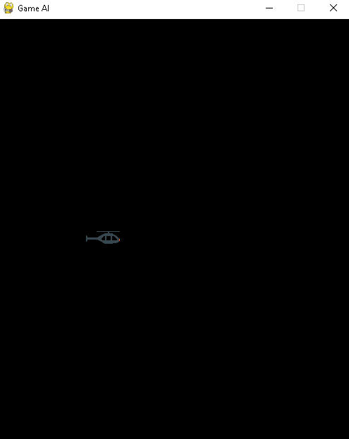
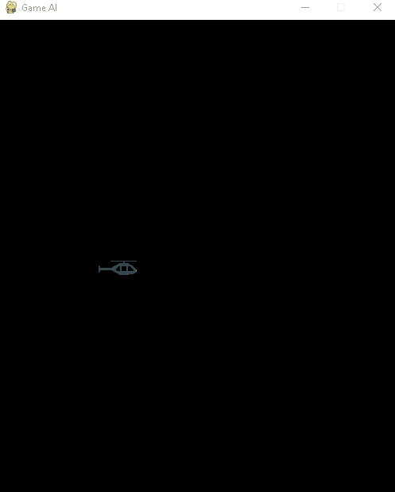
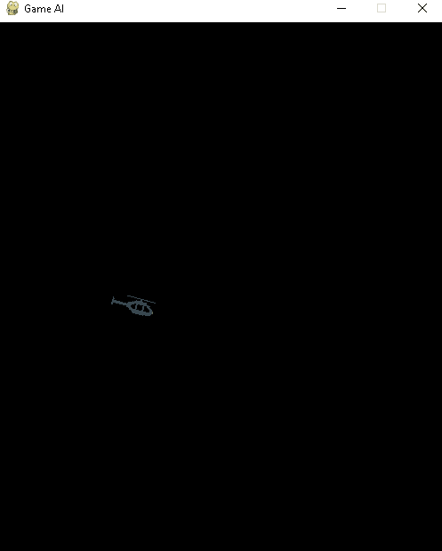
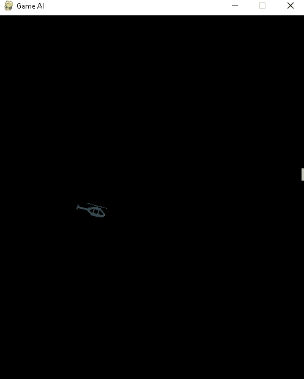
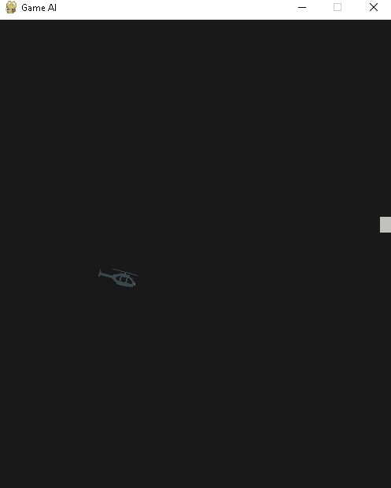

# AI Copter
AI that learns to play Classic Copter game.

### Pygame window and copter pixel image on it

### Copter with gravity effect

### With jumping implemented

### Copter game with obstacles

### With collision

